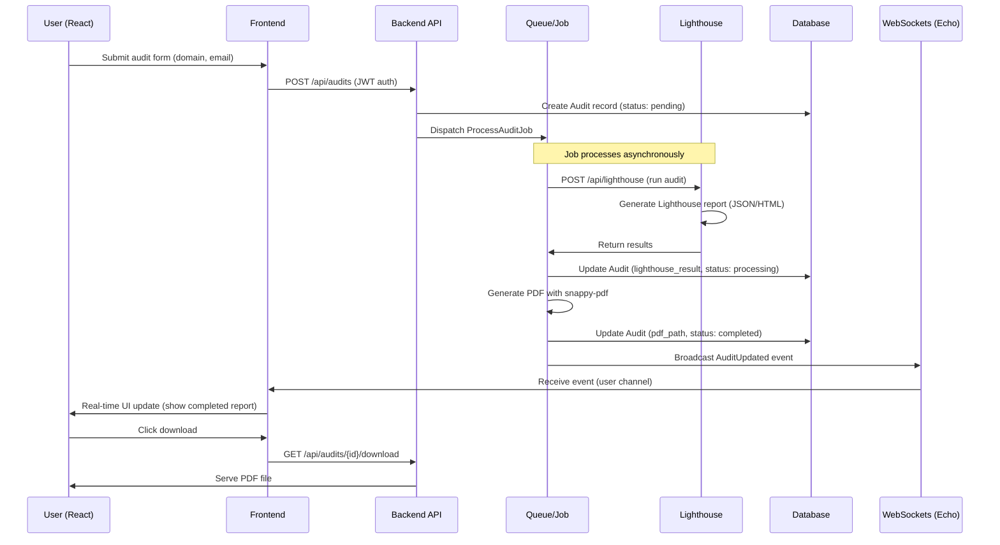

# EZAudit Migration Plan: Laravel Backend with React Frontend

## Overview

This plan migrates the existing Next.js project (EZAudit) to a Laravel backend with a React SPA frontend using Vite. The core functionality remains: signed-in users request website performance audits via Google's Lighthouse, reports are queued on the backend, and users view pending/completed reports (with PDF downloads) in their dashboard. Key changes:

- Backend: Laravel handles auth (JWT), API, queues for audits/PDF generation, custom Lighthouse integration, and real-time updates via Laravel Echo/WebSockets.
- Frontend: React SPA (Vite build) consumes Laravel API, migrates components, uses Chakra UI, and integrates Echo for real-time dashboard updates.
- Database: MySQL.
- Local Dev: Docker.
- Lighthouse: Custom internal API endpoint (/api/lighthouse) to run audits.
- PDF: Snappy-pdf in queued jobs.
- Auth: JWT (no Google OAuth as per latest clarification; can adjust if needed).

## Current Project Summary (Completed Analysis)

- **Structure**: Next.js app with pages (home, dashboard, terms), API routes (proxy to Lighthouse), components (AuditForm, AuditResult, Dashboard), models (Audit interfaces), utils (constants, routes, theme).
- **Dependencies**: Chakra UI, React Hook Form, Framer Motion, Next.js, TypeScript.
- **Key Features**:
  - Audit submission: Form validates URL/email, proxies to external Lighthouse (via env var).
  - Dashboard: Basic page with cookie-based user auth; lists audits (not fully implemented).
  - Models: Audit results parsed into categories (accessibility, performance, etc.).
  - No full queue/PDF/dashboard yet; assumes external service handles crawling/reporting.

## Integration Details (Clarified)

- **Lighthouse Endpoint**: Custom Laravel API at `/api/lighthouse` (runs Lighthouse CLI or service internally).
- **PDF Generation**: Use `barryvdh/laravel-snappy` with wkhtmltopdf in a queued job to generate PDF from Lighthouse HTML report.
- **Database Schema**:
  - `users`: id, name, email, password, email_verified_at, remember_token (standard Laravel).
  - `audits`: id, user_id (FK), domain, email, status (pending/processing/completed/failed), lighthouse_result (JSON), pdf_path, created_at, updated_at.
- **Auth**: JWT via `tymon/jwt-auth` package.
- **Deployment**: Docker for local (Laravel, MySQL, queues); production self-hosted (e.g., VPS with Nginx, Supervisor for queues).

## Laravel Backend Architecture (Detailed Design)

1. **Project Setup**:
   - Install Laravel 11.x via Composer.
   - Configure `.env`: DB (MySQL), QUEUE_CONNECTION=database, JWT_SECRET, LIGHTHOUSE_PATH (for CLI).
   - Install packages: `tymon/jwt-auth` (auth), `barryvdh/laravel-snappy` (PDF), `laravel/echo-server` or Pusher for WebSockets, `puppeteer` or Lighthouse CLI for audits.
   - Set up queues: `php artisan queue:table && migrate`; use database driver initially.

2. **Models & Migrations**:
   - `User` model: Standard, with `HasApiTokens` trait for JWT.
   - `Audit` model: BelongsTo User; fields as above; casts `lighthouse_result` to array/JSON.
   - Migrations: Create users (default), audits table.

3. **API Routes (in `routes/api.php`)**:
   - Auth: POST `/login`, POST `/register`, POST `/logout` (JWT guard).
   - Audits: POST `/audits` (submit/enqueue), GET `/audits` (user's reports), GET `/audits/{id}/download` (PDF serve).
   - Lighthouse: POST `/lighthouse` (internal; run audit on domain, return JSON/HTML).

4. **Controllers**:
   - `AuthController`: Handle login/register/logout, return JWT token.
   - `AuditController`: Submit audit (validate, create Audit record with status 'pending', dispatch `ProcessAuditJob`), list audits (with status filter), download PDF.
   - `LighthouseController`: Run Lighthouse on domain (use `exec` or Node.js bridge for CLI), return results.

5. **Jobs & Queues**:
   - `ProcessAuditJob`:
     - Call `/api/lighthouse` internally.
     - Parse results, update Audit `lighthouse_result`.
     - Generate PDF with Snappy (HTML template from results), save to storage, update `pdf_path` and status to 'completed'.
     - Broadcast event via Echo: `AuditUpdated` (with audit ID/status).
   - Handle failures: Update status 'failed', notify user.

6. **Real-Time (Echo/WebSockets)**:
   - Install Laravel Echo Server or use Redis/Pusher.
   - Events: `AuditUpdated` broadcasts to user's channel.
   - Channels: Private user channels for auth.

7. **Middleware**: JWT auth on protected routes; CORS for React.

## React Frontend Migration Plan

1. **Setup**:
   - Create new React app with Vite + TypeScript: `npm create vite@latest ezaudit-frontend -- --template react-ts`.
   - Install deps: Chakra UI, React Hook Form, Framer Motion, `laravel-echo` (for WebSockets), `axios` (API), `react-router-dom` (routing), `jwt-decode` (token handling).
   - Configure Vite: Proxy API to Laravel (`/api` -> `http://localhost:8000`), env vars for API base.

2. **Structure**:
   - `src/components/`: Migrate AuditForm, AuditResult, Dashboard, Navbar, etc.
   - `src/pages/`: Home (with form), Dashboard (audits list), Login/Register.
   - `src/services/`: API client (Axios with JWT interceptor).
   - `src/hooks/`: Auth hook (login/logout, token storage in localStorage), useEcho for real-time.
   - `src/contexts/`: AuthContext for user state; AuditContext for reports.
   - `src/types/`: Migrate models/Audit.ts interfaces.

3. **Key Migrations**:
   - **Auth**: Google OAuth -> JWT: Login form submits to `/api/login`, store token, protect routes with PrivateRoute component.
   - **AuditForm**: Update onSubmit to POST `/api/audits` with JWT header; show success/error alerts.
   - **Dashboard**: GET `/api/audits`, display list with status badges (pending/completed); use Echo to listen for `AuditUpdated` events, refetch or update state in real-time (no polling).
   - **AuditResult**: Display parsed Lighthouse scores; download button links to `/api/audits/{id}/download`.
   - Remove Next.js specifics: No `pages/`, use React Router; migrate `_app.tsx` providers (Chakra, QueryClient if used) to `main.tsx`.

4. **State Management**: Use React Context for global (auth, audits); or Zustand/Redux if complex.

5. **Real-Time**: Initialize Echo client with Laravel config; channel join on dashboard mount, listen for events to update audits list.

## Data Flow Outline

## Asset Migration Steps

- **Static Files**: Copy `public/static/` (images, manifest, favicon) to React `public/`.
- **Utils**: Migrate `utils/constants.ts`, `routes.ts`, `theme.ts` to `src/utils/`; update routes for React Router.
- **Models**: Copy `models/` to `src/types/` as TS interfaces.
- **Next.js Cleanup**: Remove `pages/api/`, `_app.tsx`/`_document.tsx` logic to React root; no SSR needed.
- **Package.json**: Update scripts for Vite (dev: `vite`, build: `vite build`); migrate non-Next deps.

## Testing & Validation Plan

- **Backend**:
  - Unit: PHPUnit for controllers (auth, audit submission), jobs (mock Lighthouse/PDF).
  - Integration: API tests with JWT (Pest/PHPUnit), queue jobs (dispatch and assert DB updates).
  - Cover: OAuth/JWT, queue failures (retry logic), PDF generation, Echo broadcasts.
- **Frontend**:
  - Unit: Jest + React Testing Library for components (form validation, dashboard render).
  - E2E: Cypress for user flows (login, submit audit, real-time update, download).
- **Error Handling**: Jobs catch Lighthouse failures, update status 'failed', email user; frontend shows toasts for API errors.
- **Validation**: Lighthouse results schema; PDF integrity checks.

## Deployment Plan

- **Local (Docker)**:
  - `docker-compose.yml`: Services for Laravel (php:8.2-apache), MySQL (8.0), Redis (for queues/Echo if used).
  - Volumes: Laravel code, MySQL data.
  - Run: `docker-compose up`; queues via Supervisor or `php artisan queue:work`.
- **Production (VPS Self-Hosted)**:
  - Server: Ubuntu, Nginx (proxy to Laravel:8000, React build serve from `/var/www/frontend`).
  - DB: MySQL on VPS or managed.
  - Queues: Supervisor to run `queue:work`.
  - Env: Secure JWT, DB creds; Lighthouse CLI installed.
  - CI/CD: GitHub Actions to build React (Vite), deploy Laravel via Forge/Envoyer.
  - HTTPS: Let's Encrypt.

This plan ensures a scalable, queued system with real-time features. Total migration: ~2-4 weeks depending on testing.
